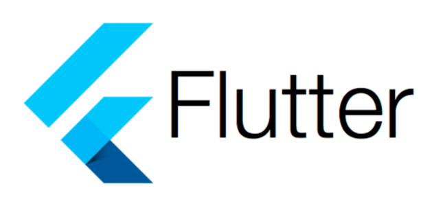
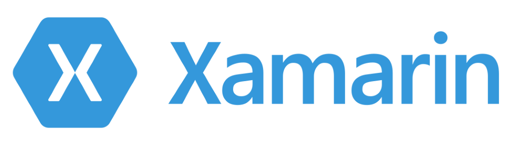
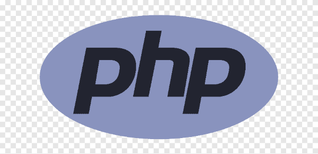
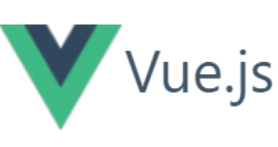
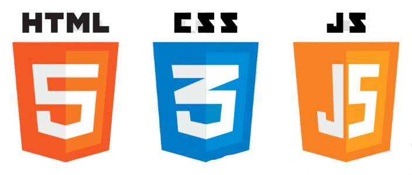
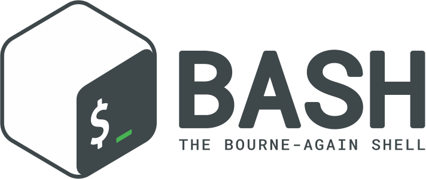

### Hola a tod@s 👋

Mi nombre es Carlos Felipe Aguirre Taborda, trabajo hace 6 años como desarrollador de software, actualmente me dedico al  desarrollo móvil  con Xamarin y Flutter.

- 🔭 Actualmente trabajo como desarrollador móvil en Carvajal Tecnología y Servicios allí me encargo de apps móviles para el sector salud, de algunas de las entidades más grandes del país.

- 🌱  Actualmente estoy aprendiendo a cerca del análisis y visualización de datos en grandes volúmenes de información, Power BI, MATLAB...

- 👯 Me encantaría colaborar en proyectos open source de desarrollo móvil.

- 📫 Me puedes contactar a través de mi  <a href="https://www.linkedin.com/in/carlos-aguirre-t">linkedin<a>

